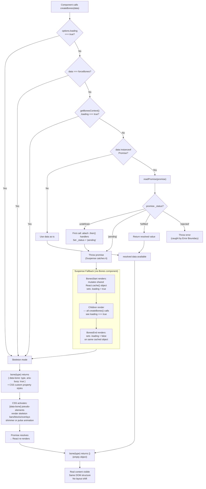

# vite-plus-starter

A starter for creating a Vite Plus project.

## Development

- Install dependencies:

```bash
vp install
```

- Run the unit tests:

```bash
vp test
```

- Build the library:

```bash
vp pack
```

## How It Works

The diagram below shows the full data lifecycle through the bones library — from `createBones` input to rendered output.


