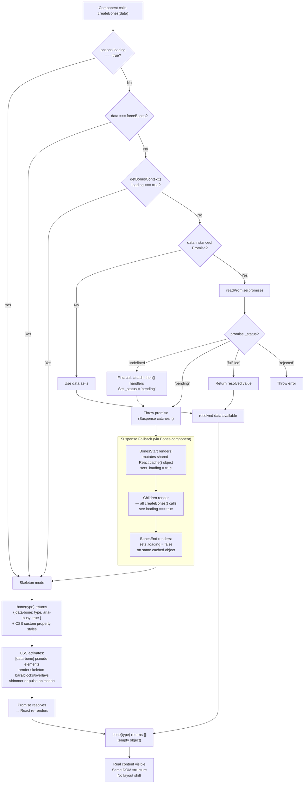

The diagram below shows the full lifecycle of data through the bones library. Follow it top-to-bottom to see how `createBones` determines whether to show skeletons or real content, and how each piece — `readPromise`, `React.cache` context, `bone()` attributes, and CSS — fits together.

## Key takeaways

- **Decision order matters.** `createBones` checks `options.loading`, then `forceBones`, then the `React.cache` context, then whether data is a Promise — in that order. The first match wins.
- **`readPromise` is idempotent.** The `.then()` handlers are attached only on the first call. Subsequent calls read the cached `_status` directly.
- **`React.cache` replaces React Context.** The `<Bones>` component uses `BonesStart` and `BonesEnd` to mutate a shared object scoped to the current render pass — no Context provider needed.
- **CSS does the visual work.** The `bone()` function only sets data attributes. The actual skeleton appearance is driven entirely by CSS pseudo-elements and custom properties.
